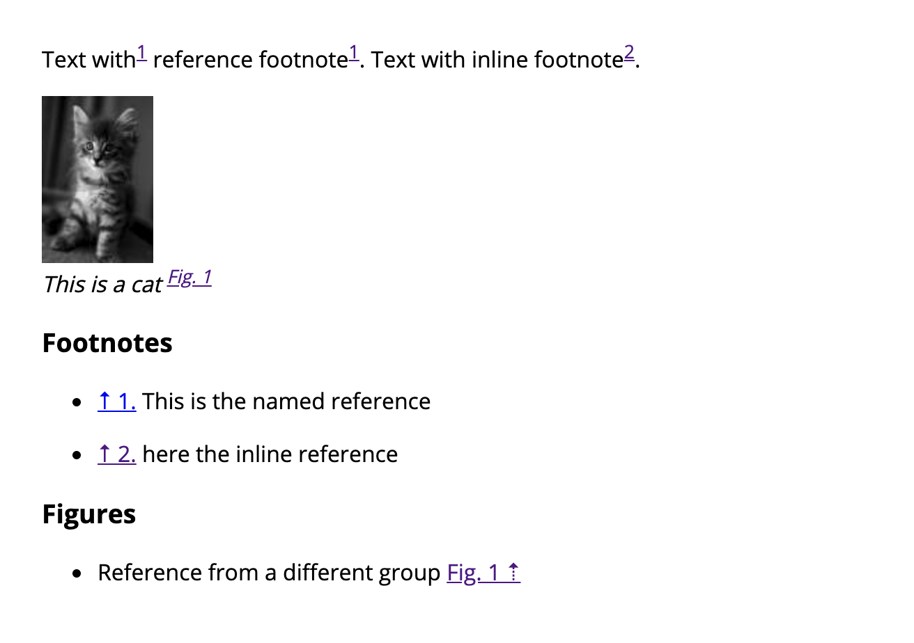

# Footnotes in Gatsby

[![Downloads][downloads-badge]][downloads]

[Gatsby][gatsby] plugin using [remark][remark] to generate footnotes with advanced grouping.


## Installation

```sh
npm i gatsby-remark-reference-footnotes
```


## Use
Generate footnotes:

````md
[^Normal footnote]


```references
# This code block gets replaced with footnotes
```
````

Generate footnotes for a specific group of footnotes:
````md

[^:fig:Footnot for group named `fig`]

```references
# This code block gets replaced with footnotes for group `fig`
group-include: fig
```
````

If you like to overwrite the global settings in place (camelCase or kebab-case):

````md
```references
# This code block gets replaced with footnotes
group-include: fig

inline-link-prefix: ' Fig. '
inline-link-suffix: '.'
inline-text-prefix: ' '
inline-text-suffix: ''

reference-link-position: end

reference-link-prefix:  ' Fig. '
reference-link-suffix:  '.⇡'
reference-text-prefix:  ' '
reference-text-suffix:  ''
```
````


## Global Configuration
Global configurations can be set in `gatsby-config.js`.

```js
module.exports = ({ root }) => ({
  plugins: [
    {
      resolve: `gatsby-transformer-remark`,
      options: {
        plugins: [
          {
            resolve: `gatsby-remark-reference-footnotes`,
            options: {
              groupInclude: 'default',

              inlineLinkPrefix: '',
              inlineLinkSuffix: '',
              inlineTextPrefix: '',
              inlineTextSuffix: '',

              referenceLinkPosition: 'start',

              referenceLinkPrefix:  '↑ ',
              referenceLinkSuffix:  '.',
              referenceTextPrefix:  '',
              referenceTextSuffix:  ' '
            },
          }
        ],
      },
    },
  ],
})
```


## Options
### `group-include`

`string?` — default: `default`  
If a footnote reference starts with `:groupname:` the output can be filtered by this group-name.


### `reference-link-prefix`

`string?` — default: `↑ `
*Footnote:* in link before reference number

### `reference-link-suffix`

`string?` — default: `.`
*Footnote:* in link after reference number

### `reference-text-prefix`

`string?` — default: `''`
*Footnote:* text before reference link

### `reference-text-suffix`

`string?` — default: `' '`
*Footnote:* text after reference link


### `reference-link-position`

`string?` — default: `start` – options: `start`|`end`
*Footnote-Reference:* should the reference link be at the `start` or `end`

### `inline-link-prefix`

`string?` — default: `''`
*Footnote-Reference:* in link before inline number

### `inline-link-suffix`

`string?` — default: `''`
*Footnote-Reference:* in link after inline number

### `inline-text-prefix`

`string?` — default: `''`
*Footnote-Reference:* text before inline link

### `inline-text-suffix`

`string?` — default: `''`
*Footnote-Reference:* text after inline link


## Example

### Input

````md
Text with[^test] reference footnote[^test].
Text with inline footnote[^here the inline reference].


*This is a cat [^:fig:Reference from a different group]*

<!-- refs -->
[^test]: This is the named reference

### Footnotes
```references
# gets repalced with footnotes
```

### Figures
```references
# gets repalced with footnotes
group-include: fig
inline-link-prefix: 'Fig. '
reference-link-position: end
reference-link-prefix: ' Fig. '
reference-link-suffix: ' ⇡'
reference-text-prefix: ' '
```
````

### Output


## License

[MIT][license] – [Stefan Huber][author]

<!-- Definitions -->


[gatsby]: https://www.gatsbyjs.org/
[remark]: https://github.com/remarkjs/remark
[downloads]: https://www.npmjs.com/package/gatsby-remark-reference-footnotes
[downloads-badge]: https://img.shields.io/npm/v/gatsby-remark-reference-footnotes.svg
[license]: https://opensource.org/licenses/MIT
[author]: http://signalwerk.ch/
